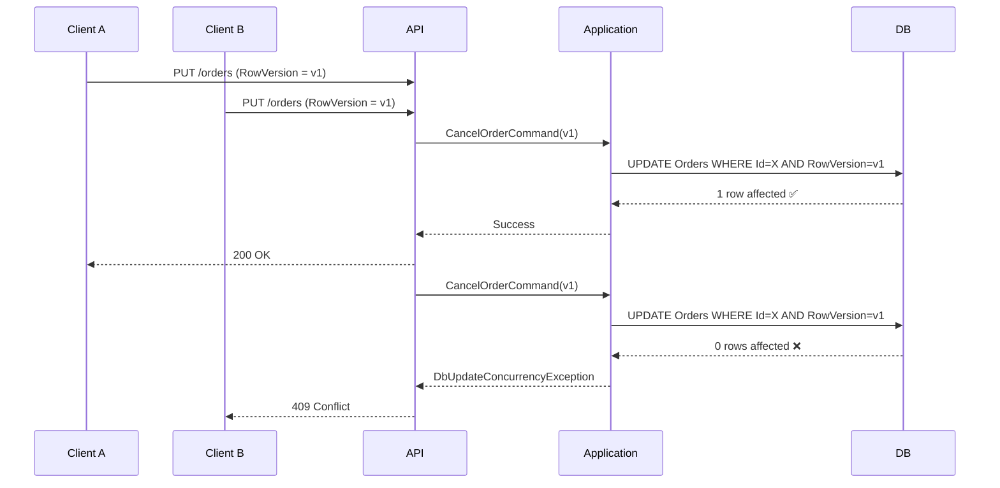

# 🚀 Optimistic Concurrency Flow (EF Core + RowVersion)

## High-Level Sequence



---

## Conceptual Flow

```
Client
   ↓ (RowVersion = Base64)
API Endpoint
   ↓
Application Layer
   ↓ (Set OriginalValue)
EF Core
   ↓
SQL Server
   ↓
UPDATE ... WHERE Id = @id AND RowVersion = @expected
```

---

## Decision Logic

```
IF rowsAffected == 1
   → Success
ELSE
   → Concurrency Conflict (409)
```

---

## Architectural Boundaries

• Domain → unaware of HTTP & concurrency mechanics  
• Application → coordinates expected version  
• Infrastructure → database enforces truth  
• API → maps DbUpdateConcurrencyException → 409 Conflict  

---

## Key Insight

Optimistic concurrency is not about comparing versions manually.

It is about:

✔ Letting the database enforce consistency  
✔ Letting EF translate conflicts  
✔ Mapping conflicts to predictable HTTP responses  

---

"Lost updates" become impossible.
Silent overwrites disappear.
Concurrency becomes explicit and controlled.

